## What is `dbt`?
`dbt` (data build tool) is a tool that allows you to easily build and maintain data pipelines and data warehouses. Recently it gained more and more popularity as it bridges the gap between data engineering and data analytics and subsequently enabling the emergence of analytics engineering as a field.

There are two major data integration processes used in data pipelines, called *ETL* and *ELT*. The key difference between both lies in the order of operations. 

- In **ETL**, the data is first extracted from the source system, then transformed and finally loaded into the data warehouse. 
- While in **ELT**, the data is extracted from the source system, loaded into the data warehouse and transformed afterwards. So in contrast to ETL, upon arrival in the data warehouse, the data is still raw. 

`dbt` is commonly used in the transformation part of **ELT** because it facilitates the creation and maintenance of data transformations in a way that is testable and version controlled. Hence it allows you to transform and analyze your data in a structured and documentable way, while tailoring it to your client's needs.

## Why `dbt`?
There are a lot of reasons why you should use `dbt` where some of them are mentioned below:
- It is open source and free to use
- It is very easy to *use*. You can start using it in a few minutes
- It is very easy to *test*. You can easily test your models
- It is very easy to *document*. You can easily document your models
- It is very easy to *version control*. You can easily version control your models
- It is very easy to *deploy*. You can easily deploy your models to different environments
- It is very easy to *automate*. You can easily automate your models
- It is very easy to *integrate*. You can easily integrate it with other tools
- It is very easy to *maintain*. You can easily maintain your models

## How does `dbt` work?
`dbt` is basically adding a modeling layer to the data warehouse. We get the raw data and run it through dbt models. Each dbt model is a `.sql` file which is depending either on the raw data or on other dbt models. The output of the dbt models is then stored in the data warehouse as views or tables.

In a standard `dbt` project you have the following layers:

- raw data
- staging models: where you can clean the data (rename columns, remove duplicates, etc.)
- prep models: where you can aggregate the data (sum, count, etc.)
- analysis models or mart models: where you can analyze the data (calculate the average, etc.)

These mart models often are seperated by stakeholder groups. So you have mart models for the marketing team, mart models for the sales team, etc. and they are organized in different folders and in different schemas within the data warehouse.

## `dbt` repositories

One of the `dbt` aims is to create a flow where your work will be **version controlled**. That's why all the code that `dbt` will need to model the data has to be a part of a repository. You will need to create a new repository in your GitHub that will follow this structure:
- `dbt_project.yml` - defines the project and global variables/paths
- `dbt_packages` - used if any external packages are used (same like pandas in python)
- `logs` - logs of all `dbt` runs
- `macros` - will store the code that might be repeated (like a function in python)
- `models`:
   - `staging` — creating our atoms, our initial modular building blocks, from source data
   - `prep` (intermediate) — stacking layers of logic with clear and specific purposes to prepare our staging models to join into the entities we want 
   - `marts` — bringing together our modular pieces into a wide, rich vision of the entities our organization cares about - for the stakeholers
- `seeds` — seeds are CSV files in your `dbt` project (typically in your seeds directory), that `dbt` can load into your data warehouse using the `dbt seed` command
- `snapshots` — analysts often need to "look back in time" at previous data states in their mutable tables. While some source data systems are built in a way that makes accessing historical data possible, this is not always the case. `dbt` provides a mechanism, snapshots, which records changes to a mutable table over time
- `target` — where the compiled SQL code is saved
- `tests` — tests are assertions you make about your models and other resources in your `dbt` project (e.g. sources, seeds and snapshots). When you run `dbt test`, `dbt` will tell you if each test in your project passes or fails.

## `dbt core` and `dbt cloud`
There are two ways of using `dbt`. 
1. **dbt Core:** An open-source project. It’s free to use, but it requires technical knowledge as you have to set it up locally on your computer.
2. **dbt Cloud:** A commercial product. `dbt cloud` is basically `dbt` core with a lot of additional out-of-the-box features like job orchestration, which you would have to do on your own in the open-source version.  
   

In our week we will use the beginner-friendly `dbt cloud`.

## 1. Create a Git Repository

We will need a repository with the codebase for data modeling / data pipeline:

<table class="bdrless" style="border-width: 0px">
   <tr>
    <td><b>0.</b></td>
    <td><b>Create a new Repository in your personal GitHub account.</b>
    <ol>
        <li>Click the link here on the right, or go to GitHub to your repositories and click the green button "New"</li>
        <li>Choose your handle as "Owner"</li>
        <li>Name the repo, for examlpe "dbt_meteostat".</li> 
        <li>You can make it "Private" or "Public"</li> 
        <li><b style="color:red">Please don't ADD anything else.</b>
          <ul>
            <li>no README</li>
            <li>no <code>.gitignore</code></li>
            <li>no License</li>
           </ul>
        </li>
    </ol>
    </td>
    <td><a href="https://github.com/new" target="_blank">Create a new GitHub Repo</a>
       

       
    </td>
   </tr>
</table>

## 2. Setup dbt Cloud 

### dbt cloud account with initial configuration

<table class="bdrless" style="border-width: 0px">
   <tr>
    <td><b>1.</b></td>
    <td>Go to dbt cloud sign up page</td>
    <td><a href="https://www.getdbt.com/signup/" target="_blank">dbt cloud sign up page</a></td>
   </tr>
   <tr>
    <td><b>2.</b></td>
    <td>Provide all the information needed to create an account and click on <b>Create my account</b></td>
    <td><a href="./images/setup_2.png" target="_blank">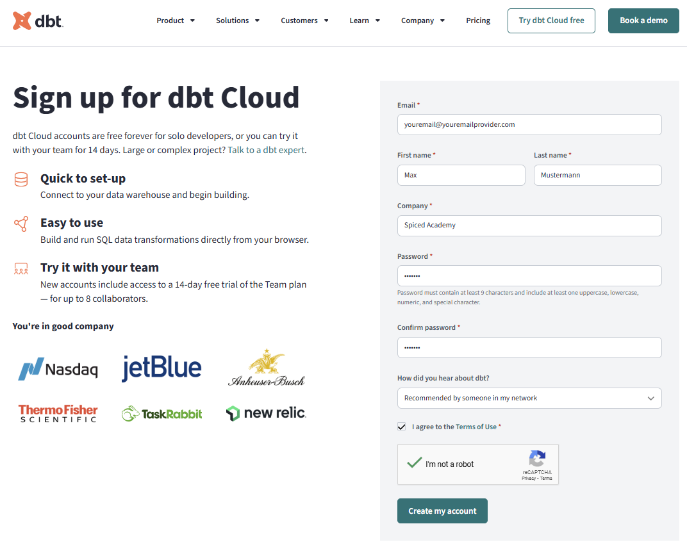</a></td>
   </tr>
   <tr>
    <td><b>3.</b></td>
    <td>Make sure you click on the verification email</td>
    <td><a href="./images/setup_3.png" target="_blank">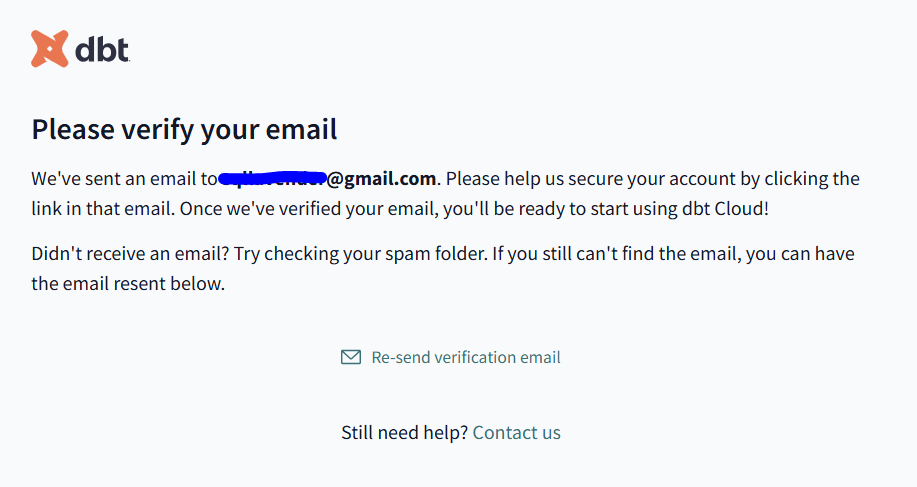</td>
   </tr>  
   <tr>
    <td><b>4.</b></td>
    <td>After that dbt will create a project and name it `Analytics` </b></td>
    <td><a href="./images/setup_4.png" target="_blank">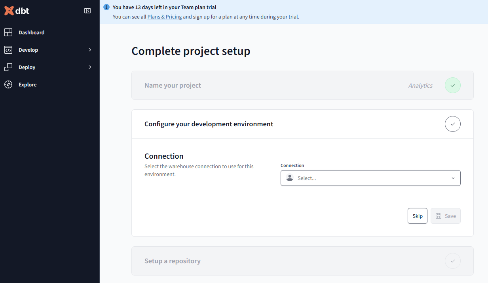</td>
   </tr>
   <tr>
    <td><b>5.</b></td>
    <td>Under the project setup we need to first to configure a <b>database connection</b> for our development environment</td>
    <td><a href="./images/setup_5.png" target="_blank">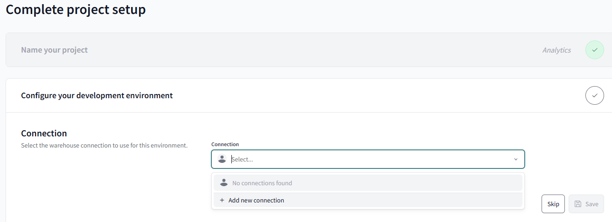</td>
   </tr>    
   <tr>
    <td><b>6.</b></td>
    <td>From the dropdown or from the panel please choose<b>PostgreSQL</b> and click on <b>Next</b></td>
    <td><a href="./images/setup_6.png" target="_blank">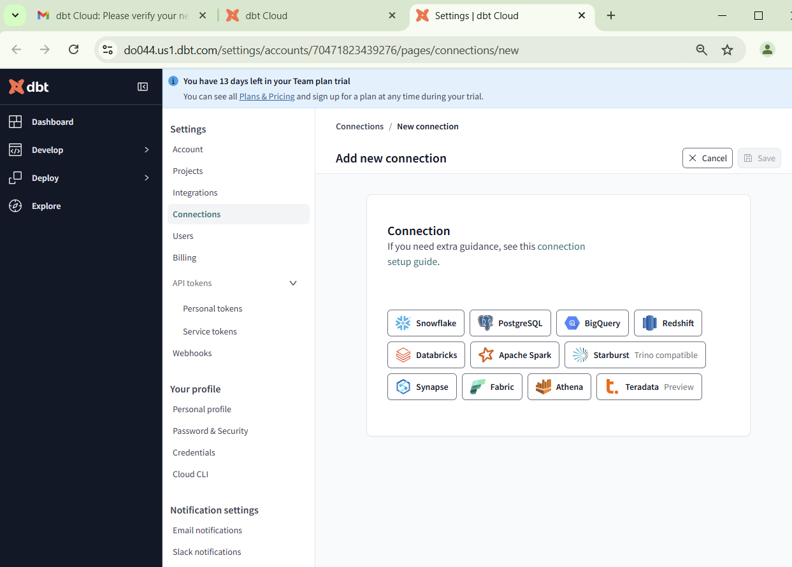</td>
   </tr> 
   <tr>
    <td><b>7.</b></td>
    <td>Provide the database credentials: 
    <li>host</li>
    <li>port </li>
    <li>and database name (the database that we used during the sql module)</li></td>
    <td><a href="./images/setup_7.png" target="_blank">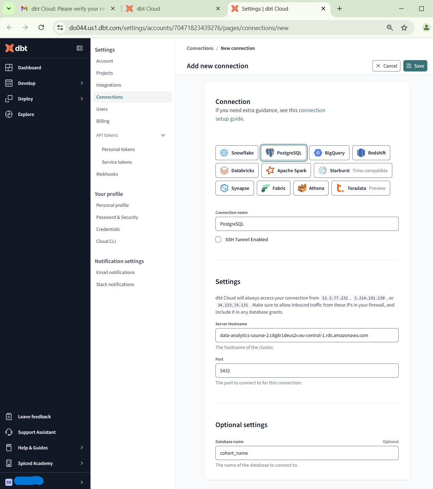</td>
   </tr> 
   <tr>
    <td><b>8.</b></td>"
    <td>Please click on "Credentials", click the name of your project(in my case "Analytics") and then click "configure development environment" and "add connection".</td>
    <td><a href="./images/setup_new1.png" target="_blank">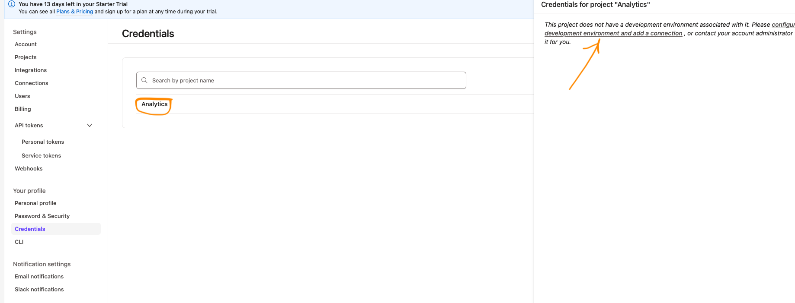</td>
   </tr>    
   <tr>
    <td><b>9.</b></td>
    <td>Under <b>Development Credentials</b> provide your credentials including username (which is given to you during the sql module), password to the instance and the schema(your own schema) that should be set to <b>public</b></td>
    <td><a href="./images/setup_8.png" target="_blank">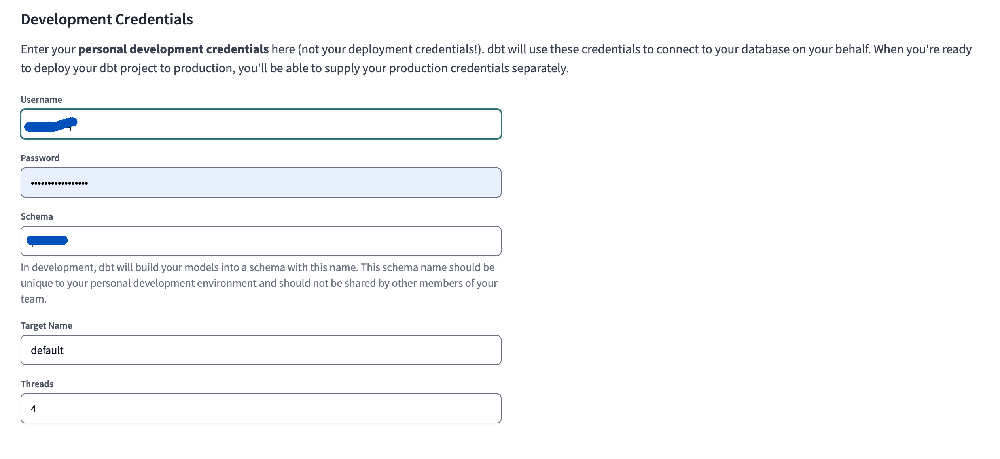</td>
   </tr>
   <tr>
    <td><b>10.</b></td>
    <td>Test your database connection!</td>
    <td><a href="./images/setup_9.png" target="_blank">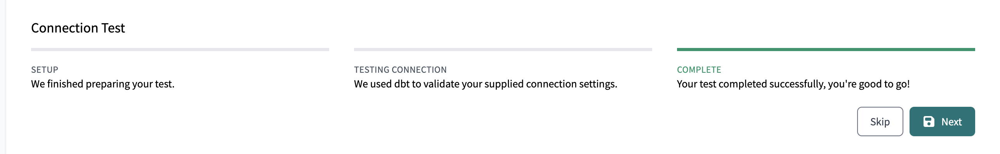</td>
   </tr>
   <tr>
    <td><b>11.</b></td>
    <td><b>Setup a repository:</b>  
    dbt can also get access to a github repo using ssh key
    <li>choose "Git Clone" option. (not "GitHub"!)</li>   
    <li>follow the steps 11-15</li>
    </td>
    <td><a href="./images/setup_10.png" target="_blank">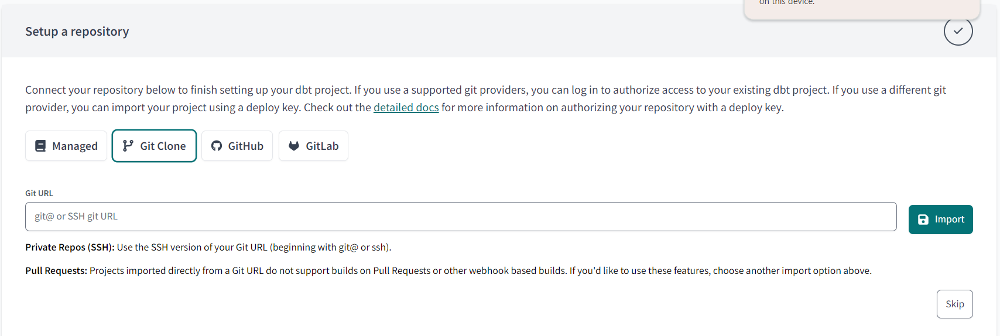</td>
   </tr>
   <tr>
    <td><b>12.</b></td>
    <td>Copy the ssh connection and the link taken from your repository (check it on github.com) under the <b>Code</b> button.</td>
    <td><a href="./images/setup_11.png" target="_blank">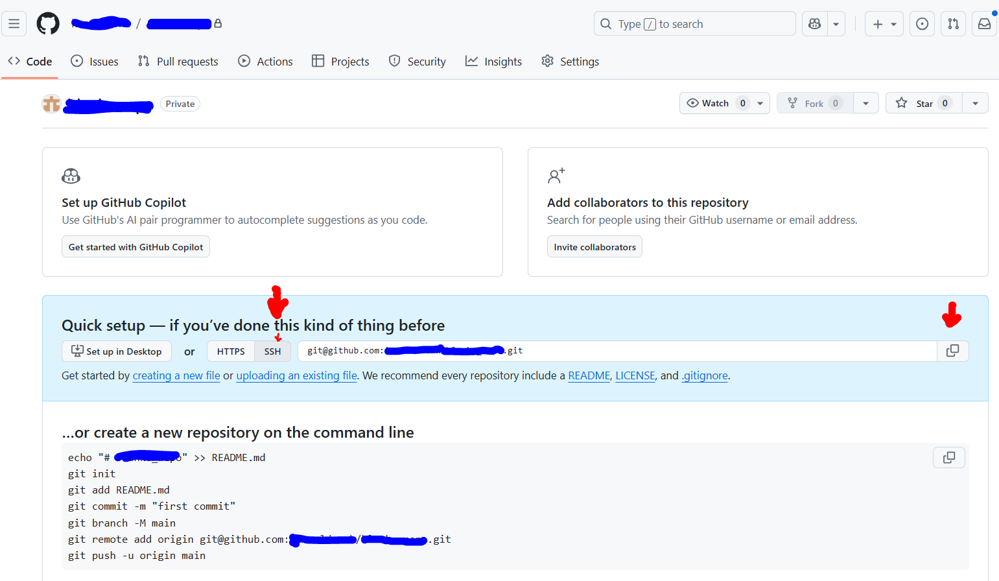</td>
   </tr>
   <tr>
    <td><b>13.</b></td>
    <td>Paste the link to dbt setup. It will generate an ssh key. You need to add to the repo on github.com. 
    <li>Copy the ssh-rsa key</li>
    <li><a href="https://docs.getdbt.com/docs/cloud/git/import-a-project-by-git-url#github">tutorial</a></td>
    <td><a href="./images/setup_12.png" target="_blank">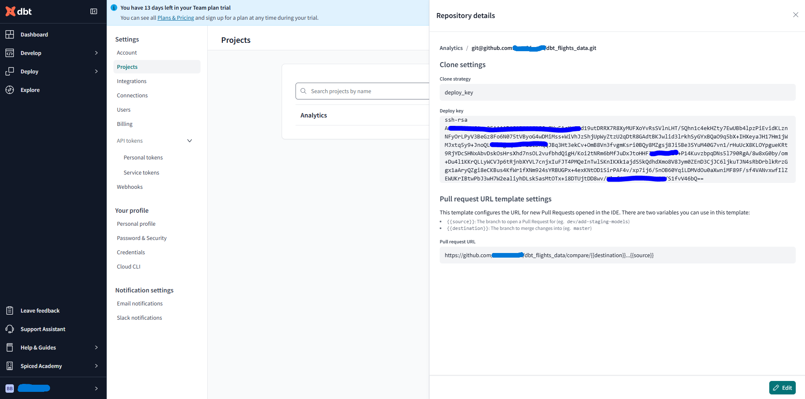</td>
   </tr>
   <tr>
    <td><b>14.</b></td>
    <td>
      <li>open your new empty repository, find <b>Settings</b> in the top nav bar</li>
      <li>from the menu on the left select <b>Deploy keys</b></li>
      <li>click the green button "Add deploy key"</li>
   </td>
    <td><a href="./images/setup_13.png" target="_blank">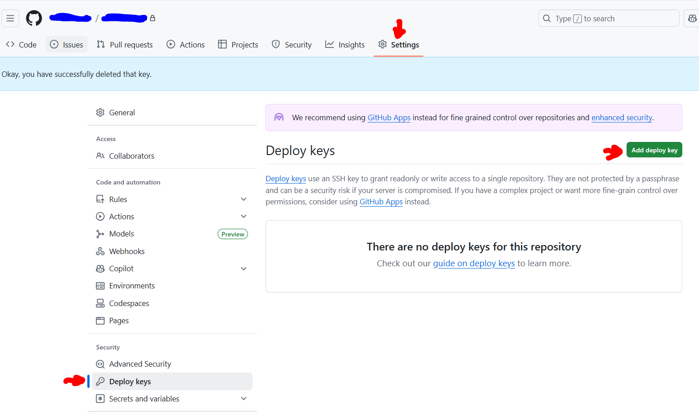</td>
   </tr>
   <tr>
    <td><b>15.</b></td>
    <td>In your GitHub:
    <ul>
      <li>give the key a name(e.g. 'dbt-weather')</li>
      <li>paste the ssh key from dbt and save it</li>
      <li>tick the checkbox "Allow write access"</li>
      <li>click "Add key" button</li>
   </ul>
   </td>
    <td><a href="./images/setup_14.png" target="_blank">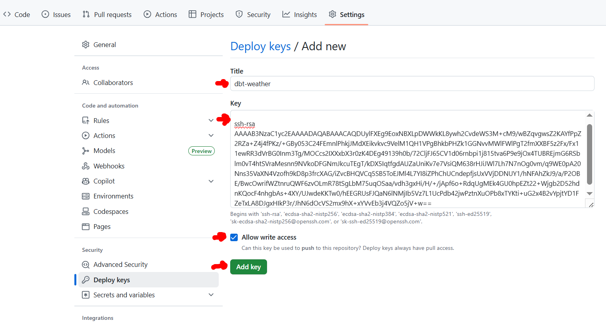</td>
   </tr>
   <tr>
    <td><b>16.</b></td>
    <td>In your GitHub: you should now see the ssh key
   </td>
    <td><a href="./images/setup_15.png" target="_blank">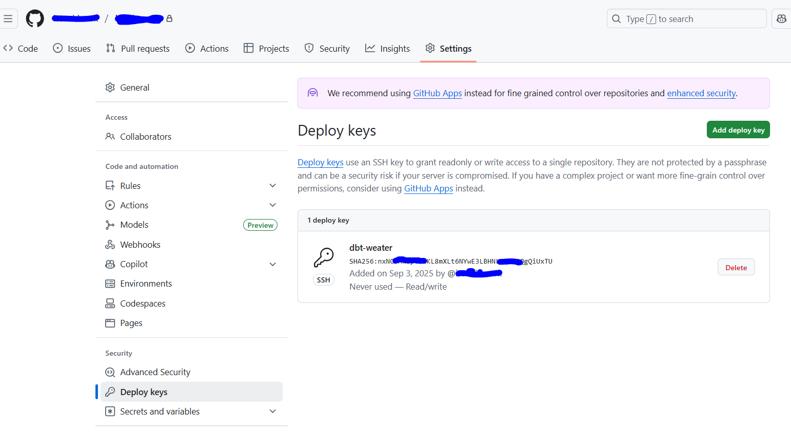</td>
   </tr>
   <tr>
    <td><b>17.</b></td>
    <td>Back to dbt repository setup. Click the Button "Next". If everything worked you might see a similar message...</td>
    <td><a href="./images/setup_16.png" target="_blank">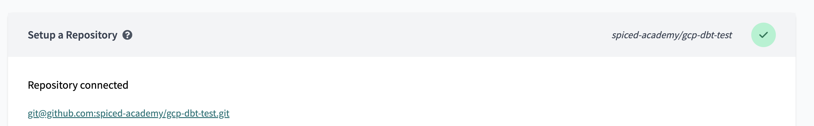</td>
   </tr>
   <tr>
    <td><b>18.</b></td>
    <td>... and your dbt project is ready!</td>
    <td><a href="./images/setup_17.png" target="_blank">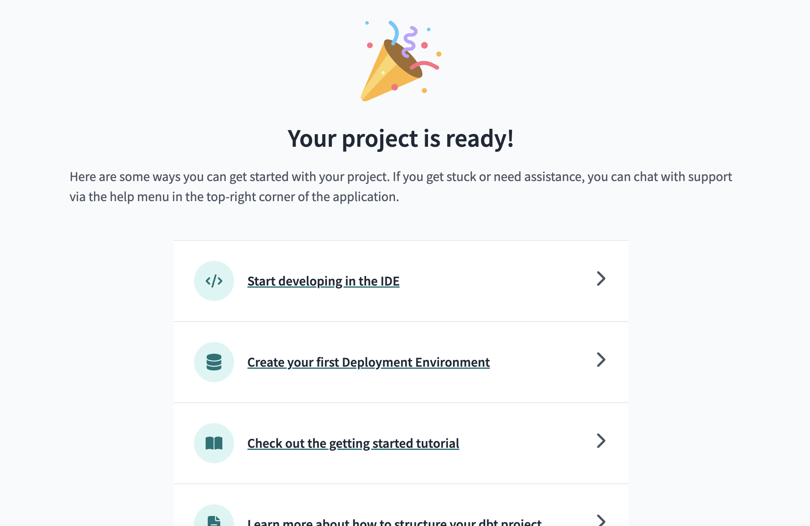</td>
   </tr>
   <tr>
    <td><b>19.</b></td>
    <td>On initial setup you will get a 14 day trial of the "Team" plan. As long as you don't enter any payment information, you can let the trial ruan out without any consequences. Even with the Team Trial you only can have one active dbt project, so there is no real benefit for our needs. At the end of the trial you can switch to the "Developer" plan. <b> 
    You can skip this step for now.</b>    
    Go to your <b>Account Settings</b> (using the icon in the top right corner) and go to the <b>Billing</b> section from the menu on the left side. Make sure you're using the developer plan which is free of charge and allows you to have one project at a time </td>
    <td><a href="./images/setup_18.png" target="_blank">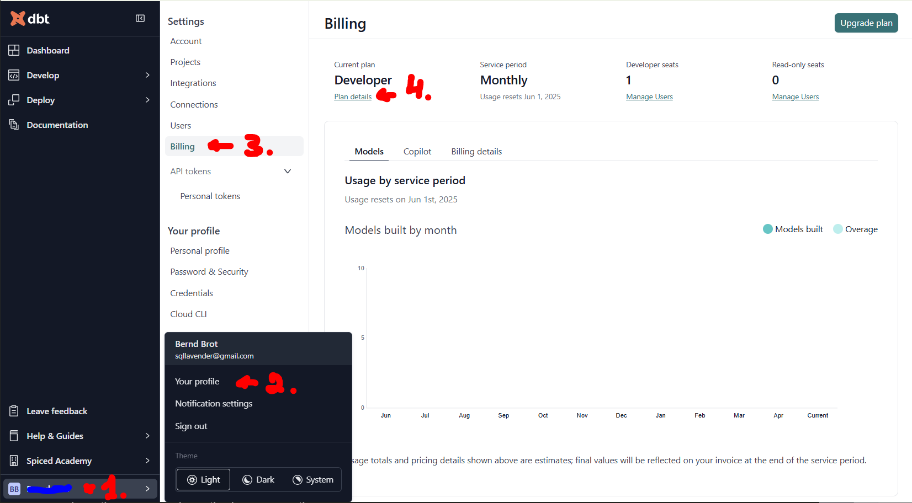</td>
   </tr>
   <tr>
       <td><b>19.</b></td>
       <td>In the navigation bar go to "Studio"
       <td><a href="./images/setup_19.png" target="_blank">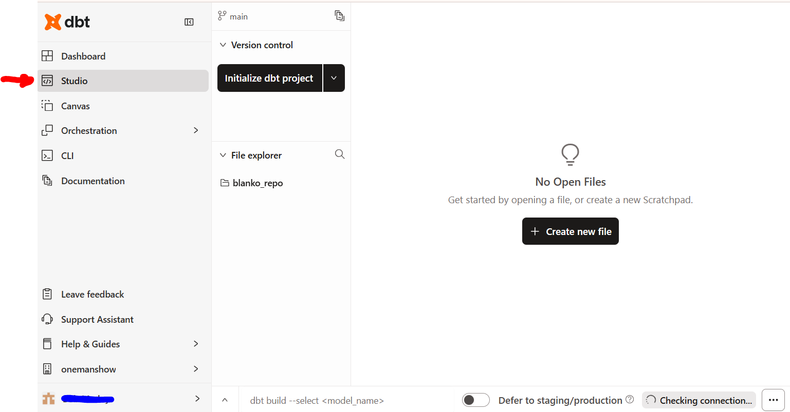</td>
      </tr>   
   <tr>
    <td><b>20.</b></td>
    <td>Secondary vertical nav bar is now showing "Version Control" and "File explorer" sections. 
      
    Under "File Explorer" you should see an empty folder with the name of your empty repo.
      
    Under "Version Control" click the button <b>Initialize dbt project</b>. It will create all the necessary folders. dbt will synchronise with GitHub and show the repo on the left under "File Explorer". Above that is the Version Control Section.  <b>Note:</b><b style="color:red"> We <u >don't need</u> to create a branch.</b> (in case you see the option)</td>
    <td><a href="./images/setup_20.png" target="_blank">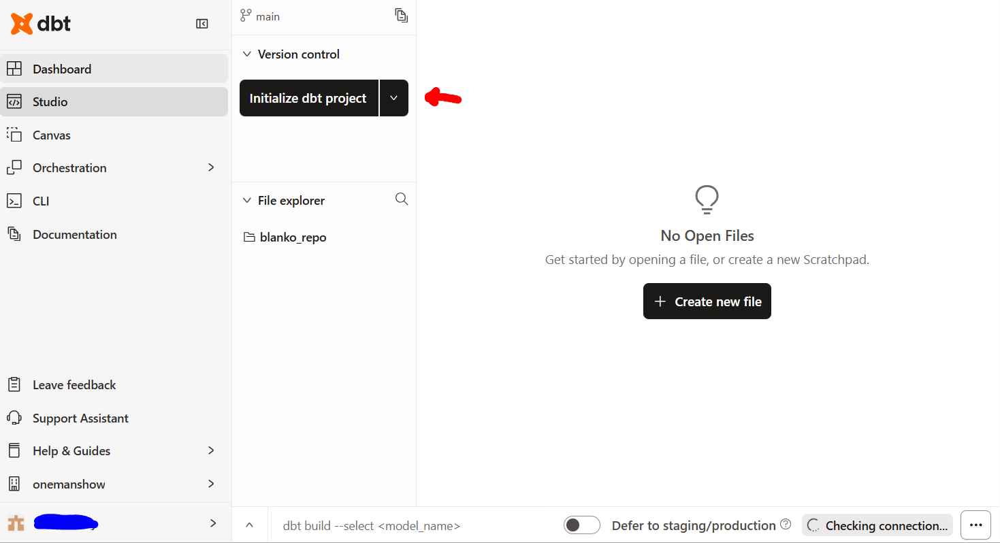</td>
   </tr>
      <tr>
    <td><b>21.</b></td>
    <td>If you forget to add SSH key it will give you the following error.  
    When you return to the Dashboard, you'll see a button suggesting to "Create environment". <b style="color:red">Don't click it.</b> 
     
    You need to add the ssh-rsa key generated by dbt to your GitHub repo (see Step 14). </td>
    <td><a href="./images/setup_21.png" target="_blank">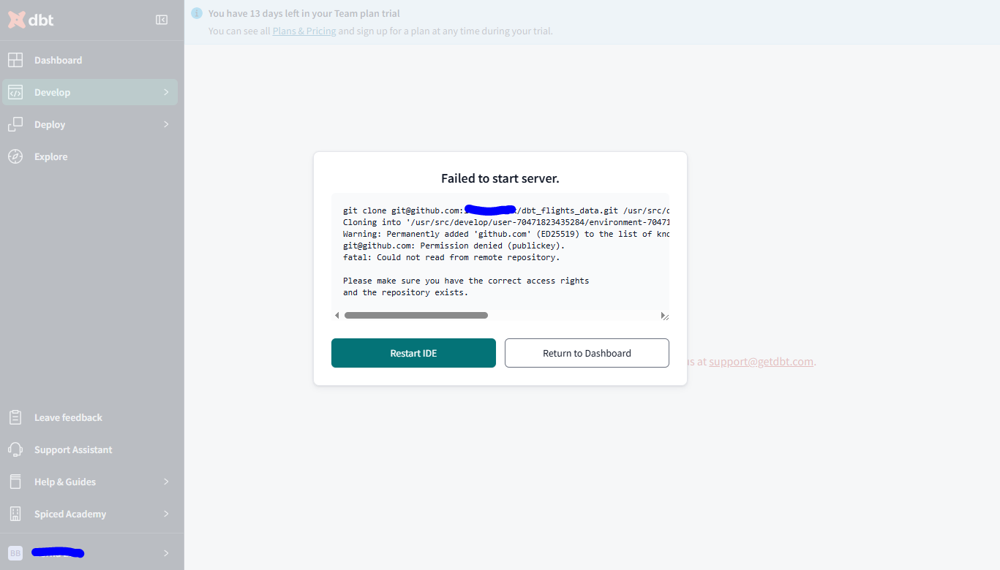</td>
   </tr>
</table>

### Reading

- [How to strucure a dbt project](https://docs.getdbt.com/guides/best-practices/how-we-structure/1-guide-overview)
- [About data transformations](https://www.getdbt.com/analytics-engineering/transformation/)
