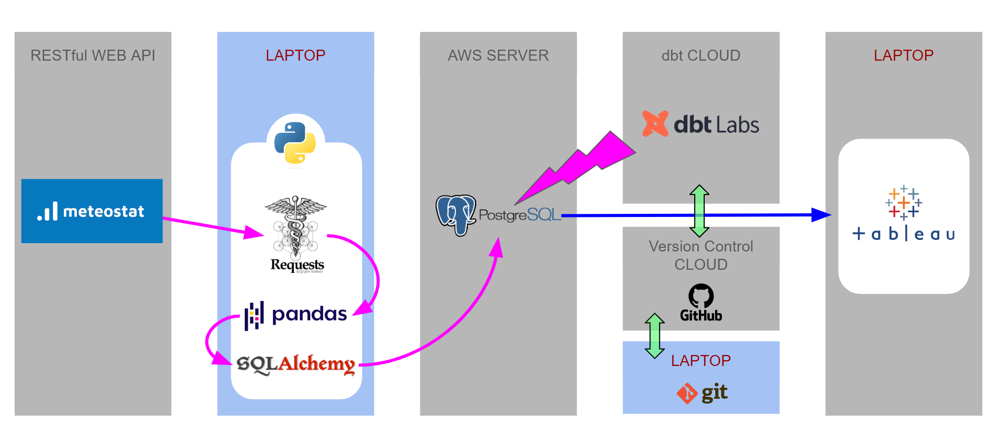
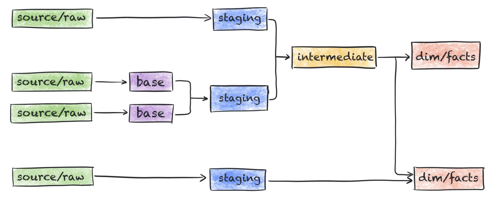
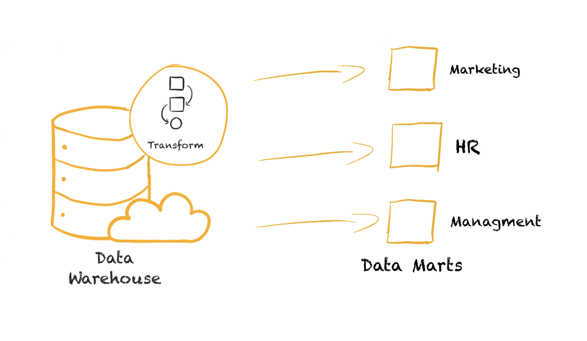

# Data Marts

This encounter is a review of the entire process so far plus we will add mart sql files to finish the transformation process. 

## 1. Review pipeline

https://docs.google.com/presentation/d/1nzs5R1U-dkHu19YMmKkSLXKLSHYm5XozARAx34SzYJw/edit#slide=id.p

## 2. Review: dbt steps

## 3. Data Marts

A data mart is a subset of a data warehouse focused on a particular line of business, department, or subject area:

- they make specific data available to a defined group of users, which allows those users to quickly access critical insights without wasting time searching through an entire data warehouse
- for example, many companies may have a data mart that aligns with a **specific department in the business**, such as finance, sales, or marketing
- also allows more fine grained access control: users see **only relevant information** and no data that they shouldn’t be able to see
- many times a data mart will directly refer to **company’s KPIs**
- a Data Mart is **the last step** in the data modeling
- as Data Marts are the information that will be shared with the stakeholders, many times we will make this part of our databases / data warehouses accessible to other people in the company (through dashboards, GUIs, etc.)

>**Read more:**
>
>- [Marts: Business-defined entities](https://docs.getdbt.com/best-practices/how-we-structure/4-marts)
>- [Fact Table vs. Dimension Table - Differences Between The Two](https://www.simplilearn.com/fact-table-vs-dimension-table-article)

## 4. Brainstorming: Stakeholder requirements

#### "KPIs for weather data" 

> **Teacher's Note: follow-up to (or as the as a sustitute for) the warmup in dbt stages lecture, alternatively **

In praxis to be able to fill a database with useful and organized tables, you would need to get familiar with the source data, in our case with the **meteostat** weather data. Think about what kind of information could be valuable for an end user. If that helps, imagine that you're asked for preparing a dashboard presenting some insights about this data.

**Task:** Simulate brainstorming stakeholders requirements.

- What kind of data structure would be easy to present the given data?

- What would be an ideal table that you would like to see in your database ?

- What fields should it have?  

- Consider the focus area of the later analysis. 
  - Which insights can be specified? 

  - Which visualizations might be required?  

- Draft some mart tables for specific use cases, which allow *"to quickly access critical insights without wasting time searching through an entire data warehouse"*

> #### Some metric candidates for KPIs:
>
> **Night vs Day** : metrics based on periods between sunrise and sunset  
> **Seasonal Stats:** statistics aggregated by defined seasons (periods)  
> **Daily Temperature Spread:** difference between maximum and minimum temperatures  
> **Wind Strength Scale:** named condition according to the Beaufort Scale  
> **Weather Condition:** name related to the weather code  
> **Heat Index**: Combines temperature and humidity to assess perceived heat  
> **Thermal Comfort Index**: Combines temperature, humidity, and wind speed  
> **Sunny:** Total count hours/days with no cloud cover per time period  
> **Rainy:** Total count hours/days with measurable rainfall. per time period  
> **Snowy:** Total count hours/days with measurable snow accumulation per time period  
> **Wet Spells:** Consecutive days with rain and/ or snow  

## 5. Create mart models:

#### 5.1 Airport Stats

In a table `mart_faa_stats.sql` we want to see **for each airport over all time**:

- unique number of departures connections

- unique number of arrival connections

- how many flight were planned in total (departures & arrivals)

- how many flights were canceled in total (departures & arrivals)

- how many flights were diverted in total (departures & arrivals)

- how many flights actually occured in total (departures & arrivals)

- *(optional) how many unique airplanes travelled on average*

- *(optional) how many unique airlines were in service  on average* 

- add city, country and name of the airport

  

#### 5.2 Flight Route Stats

In a table `mart_route_stats.sql` we want to see **for each route over all time**:

- origin airport code
- destination airport code 
- total flights on this route
- unique airplanes
- unique airlines
- on average what is the actual elapsed time
- on average what is the delay on arrival
- what was the max delay?
- what was the min delay?
- total number of cancelled 
- total number of diverted
- add city, country and name for both, origin and destination, airports

#### 5.3 Flight Route Stats incl. Weather
In a table `mart_selected_faa_stats_weather.sql` we want to see **for each airport daily**:

- only the airports we collected the weather data for
- unique number of departures connections
- unique number of arrival connections
- how many flight were planned in total (departures & arrivals)
- how many flights were canceled in total (departures & arrivals)
- how many flights were diverted in total (departures & arrivals)
- how many flights actually occured in total (departures & arrivals)
- *(optional) how many unique airplanes travelled on average*
- *(optional) how many unique airlines were in service  on average* 
- (optional) add city, country and name of the airport
- daily min temperature
- daily max temperature
- daily precipitation 
- daily snow fall
- daily average wind direction 
- daily average wind speed
- daily wnd peakgust

#### 5.4 Weekly weather

In a table `mart_weather_weekly.sql` we want to see **all** weather stats from the `prep_weather_daily` model aggregated weekly. 

- consider whether the metric should be Average, Maximum, Minimum, Sum or [Mode](https://wiki.postgresql.org/wiki/Aggregate_Mode)

#### 5.5 Custom marts (optional)

- collect ideas

- if time, feel free to write the models

  

### 6. Next Steps:

Once we got the marts ready, we can start using them. Here are some options:

- extract CSV from DB tables. In Jupyter Notebook using Pandas do some EDA and create basic plots.
- alternatively create engine with SQLAlchemy and use [pd.read_sql()](https://pandas.pydata.org/pandas-docs/stable/reference/api/pandas.read_sql.html) to import the result table directly into a pandas dataframe
- use the new tables as data sources for Tableau

